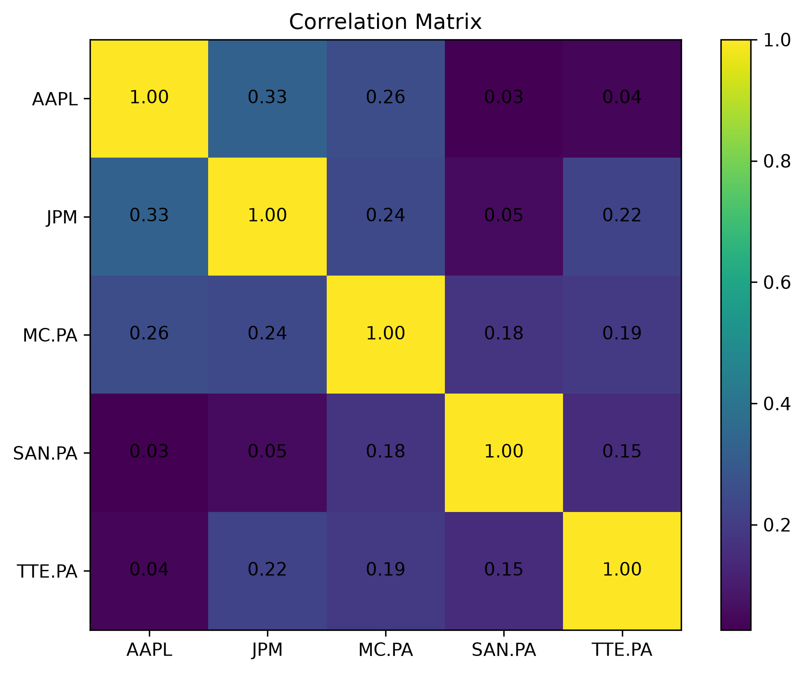
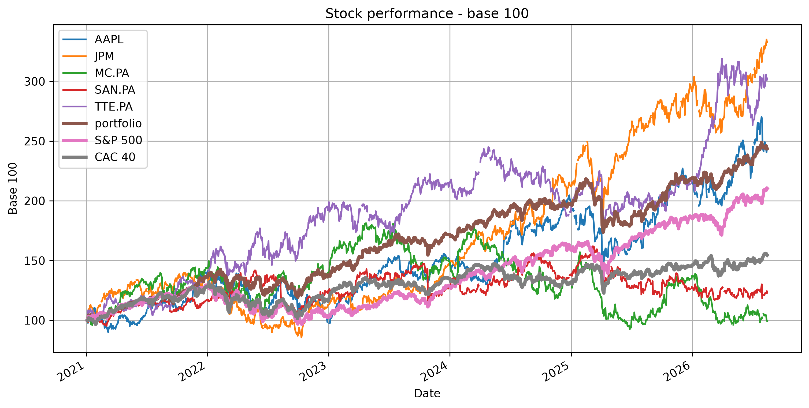
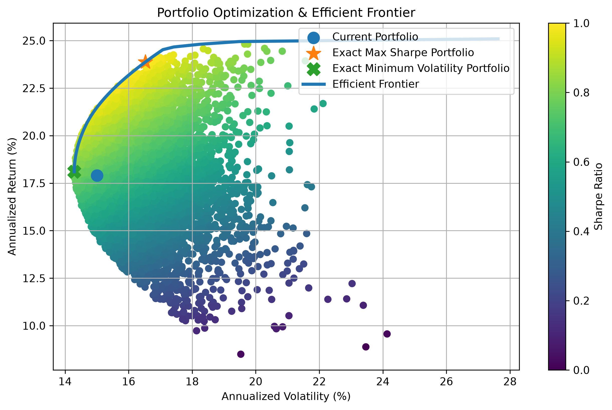
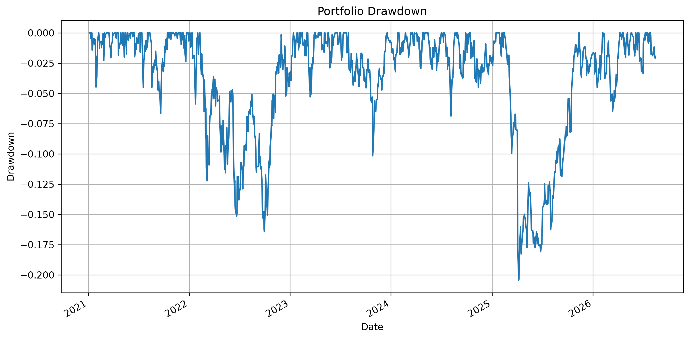

# Portfolio Analysis & Optimization in Python

## Overview

This project implements a complete portfolio analysis and optimization framework using Python and historical market data.

The objective is to evaluate the risk-return profile of a diversified equity portfolio, compare its performance with major market benchmarks, and apply Modern Portfolio Theory to identify optimized asset allocations.

The portfolio includes five US and European equities:

- Apple (AAPL)
- JPMorgan Chase (JPM)
- LVMH (MC.PA)
- TotalEnergies (TTE.PA)
- Sanofi (SAN.PA)

Market data is retrieved automatically using Yahoo Finance.

---

## Key Features

### Portfolio Performance Analysis

The program calculates several performance and risk indicators:

- Annualized return
- Annualized volatility
- Sharpe ratio
- Compound Annual Growth Rate (CAGR)
- Maximum drawdown
- Historical Value at Risk (VaR 95%)
- Conditional Value at Risk (CVaR 95%)

### Market Risk Analysis

The portfolio's exposure to the market is evaluated using:

- Beta relative to the S&P 500
- Alpha relative to the S&P 500
- Asset correlation matrix


### Benchmark Comparison

Portfolio performance is compared with:

- S&P 500
- CAC 40

This allows the portfolio's return, volatility and risk-adjusted performance to be assessed relative to major US and French equity markets.

---

## Portfolio Optimization

The project applies Modern Portfolio Theory to optimize asset allocation.

A Monte Carlo simulation generates thousands of random portfolios with different asset weights.

For each portfolio, the program calculates:

- Expected annual return
- Annualized volatility
- Sharpe ratio

The analysis identifies two key portfolios:

**Maximum Sharpe Portfolio**  
The allocation offering the highest risk-adjusted return.

**Minimum Volatility Portfolio**  
The allocation minimizing total portfolio volatility.

The optimization is also solved numerically using the SLSQP algorithm from SciPy.

---

## Efficient Frontier

The project constructs the Efficient Frontier to illustrate the optimal relationship between expected return and portfolio risk.

The visualization includes:

- Random simulated portfolios
- Current portfolio
- Maximum Sharpe portfolio
- Minimum volatility portfolio
- Efficient Frontier

- 
---

## Results

| Metric | Current Portfolio | Max Sharpe | Min Volatility | S&P 500 | CAC 40 |
|---|---:|---:|---:|---:|---:|
| Annualized Mean Return | 17.90% | 23.88% | 18.10% | 14.69% | 8.91% |
| Annualized Volatility | 15.00% | 16.53% | 14.29% | 16.63% | 15.99% |
| Sharpe Ratio | 0.97 | 1.24 | 1.03 | 0.68 | 0.34 |
| CAGR | 17.23% | 23.78% | 17.57% | 14.19% | 8.08% |
| Maximum Drawdown | -20.45% | -20.40% | -18.09% | -25.43% | -23.04% |


### Optimized Maximum Sharpe Allocation

| Asset | Weight |
|---|---:|
| AAPL | 27.77% |
| JPM | 29.96% |
| LVMH | 0.00% |
| TotalEnergies | 4.06% |
| Sanofi | 38.22% |

**Expected Return:** 23.88%  
**Volatility:** 16.53%  
**Sharpe Ratio:** 1.24

### Minimum Volatility Allocation

| Asset | Weight |
|---|---:|
| AAPL | 17.75% |
| JPM | 18.97% |
| LVMH | 7.10% |
| TotalEnergies | 32.16% |
| Sanofi | 24.01% |

**Expected Return:** 18.10%  
**Volatility:** 14.29%  
**Sharpe Ratio:** 1.03

---

## Technologies

- Python
- Pandas
- NumPy
- Matplotlib
- SciPy
- yfinance

---

## Installation

Clone the repository and install the required dependencies:

```bash
pip install -r requirements.txt
```

Then run:

```bash
python Portfolio_analysis.py
```

---

## Disclaimer

This project is intended for educational and analytical purposes only. Historical performance does not guarantee future results.